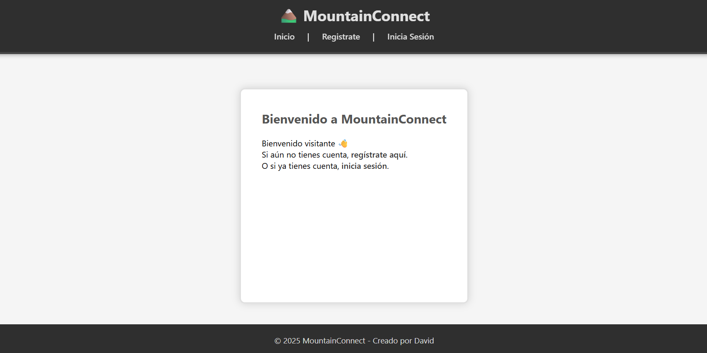
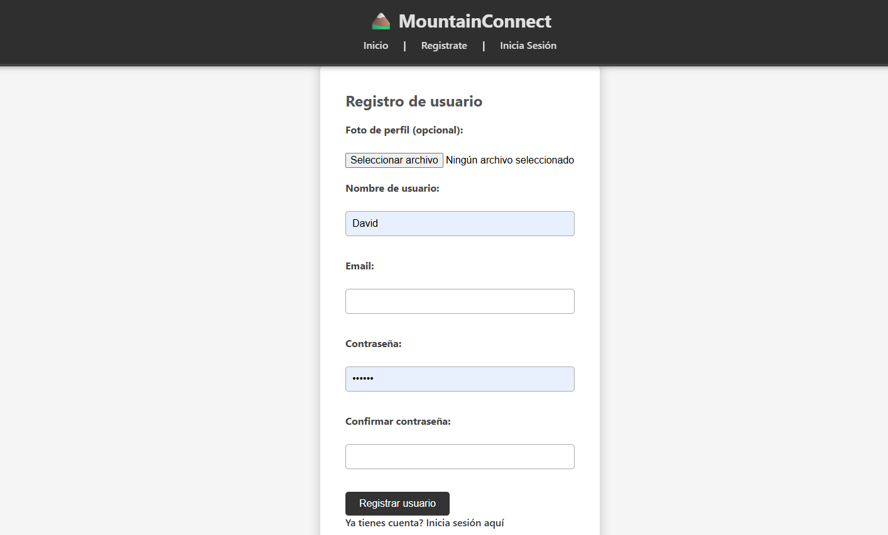
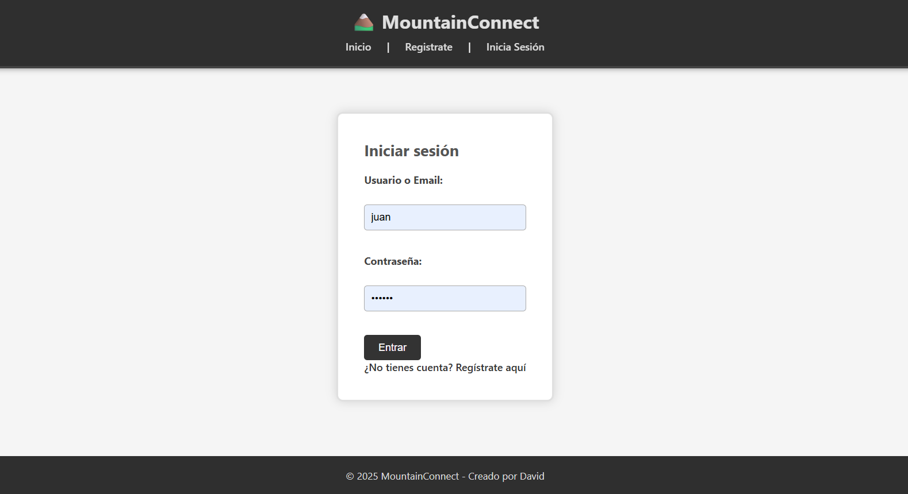

# MountainConnect 🌄

Plataforma web social para montañeros desarrollada en **PHP**. Permite compartir rutas de senderismo, vías ferratas y actividades de escalada, subir fotos, comentar y valorar experiencias.

---

## 📖 Descripción

MountainConnect es un proyecto didáctico que permite a los usuarios:

- Compartir y descubrir rutas de senderismo
- Publicar información sobre vías ferratas
- Documentar vías de escalada
- Subir fotografías de sus aventuras
- Interactuar con otros montañeros mediante comentarios y valoraciones
- Crear un perfil personalizado de montañero

Este proyecto aplica de forma práctica los conocimientos de PHP, MySQL, CRUD, validación de formularios, gestión de sesiones y subida de archivos.

---

## 🎯 Objetivos de Aprendizaje

- Desarrollar aplicaciones web dinámicas con PHP
- Diseñar e implementar bases de datos relacionales con MySQL
- Aplicar programación orientada a objetos en PHP
- Gestionar sesiones y autenticación de usuarios
- Implementar operaciones CRUD completas
- Validar formularios y gestionar subida de archivos
- Aplicar medidas de seguridad básicas (SQL injection, XSS, hash de contraseñas)
- Mantener un código limpio y estructurado

---

## 💻 Tecnologías Utilizadas

- **Backend:** PHP 7.4 o superior
- **Frontend:** HTML5, CSS3, Bootstrap
- **Servidor local:** XAMPP, WAMP o similar
- **Control de versiones:** Git / GitHub

---

## 🏗 Estructura del Proyecto

mountain-connect/
│
├── assets/
│ ├── css/
│ │ └── style.css
│ ├── js/
│ └── images/
│
├── config/
│ └── config.php
│
├── data/
│ ├── rutas.json
│ └── usuarios.json
│
├── includes/
│ ├── header.php
│ ├── footer.php
│ ├── auth_check.php
│ └── functions.php
│ 
├── public/
│ ├── index.php
│ ├── login.php
│ ├── logout.php 
│ ├── profile.php
│ ├── register.php
│ ├── routes/
│ │ ├── create.php 
│ │ ├── delete.php
│ │ ├── edit.php 
│ │ └── list.php
│ ├── admin/
│ └── photos/
│
├── uploads/
│ ├── photos/
│ └── profiles/
├── .gitignore
│
└── README.md

---

## ⚙️ Instalación Local

1. Clona el repositorio:

```bash
git clone https://github.com/dav516/mountain-connect.git
cd mountain-connect
```

Configura tu servidor local (XAMPP/WAMP):

Copia la carpeta mountain-connect a htdocs (XAMPP) o www (WAMP).

Asegúrate de que Apache esté activo.

Abre tu navegador y accede a:

http://localhost/mountain-connect/public/index.php

--- 

## 📝 Funcionalidades

Usuarios

Registro y login con validación de datos

Perfil de usuario personalizado

Gestión de sesión y logout

Rutas y actividades

CRUD completo de rutas de senderismo

Subida de fotos asociadas a cada actividad

Validación de archivos (tipo, tamaño, renombrado seguro)

Validación de email

Manejo seguro de sesiones

Funciones reutilizables y mantenibles

📸 Capturas de Pantalla


Registro de usuario


Inicio de Sesión


Perfil de usuario

CRUD de rutas


(Sustituye los enlaces con tus capturas reales antes de subir a GitHub)

🚀 Subir Proyecto a GitHub
Inicializa Git en tu proyecto:

bash
Copiar código
git init
git remote add origin https://github.com/dav516/mountain-connect.git
Crear .gitignore para ignorar archivos innecesarios:

bash
Copiar código
/vendor/
/node_modules/
*.log
*.env
/uploads/
Agrega y haz commit:

bash
Copiar código
git add .
git commit -m "Primer commit: estructura inicial del proyecto MountainConnect"
Subir al repositorio remoto:

bash
Copiar código
git branch -M main
git push -u origin main
⚠️ Si aparece el warning LF will be replaced by CRLF, configura Git:

bash
Copiar código
git config --global core.autocrlf true
📝 Criterios de Evaluación
Correcta organización de carpetas y archivos

Formularios funcionales con validación

Gestión de sesiones (login/logout)

Subida de archivos validada

Código limpio y reutilizable

Mensajes claros y experiencia de usuario adecuada

🤝 Autor
David Ultra Rey – dav516

📜 Licencia
Este proyecto es para fines educativos. No tiene licencia comercial.

yaml
Copiar código

---

Si quieres, puedo también prepararte un **.gitignore definitivo adaptado a MountainConnect** listo para copiar y pegar, para que no subas fotos ni archivos sensibles a GitHub. Esto dejaría tu repositorio completamente limpio.  

¿Quieres que haga eso también?